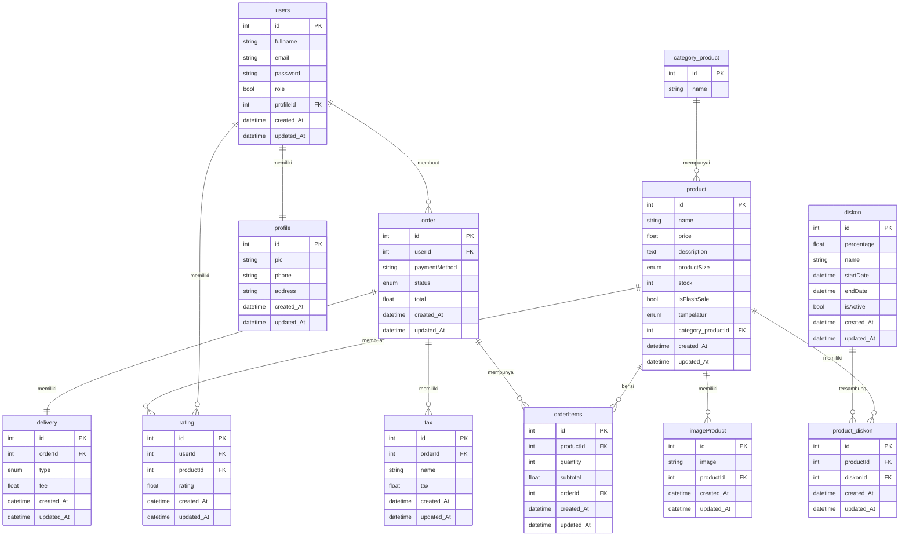

```mermaid
erDiagram
    users ||--o{ rating : "memiliki"
    users ||--o{ order : "membuat"
    users ||--|| profile : "memiliki"
    
    product ||--o{ imageProduct : "memiliki"
    product ||--o{ rating : "membuat"
    product ||--o{ orderItems : "berisi"
    product ||--o{ product_diskon : "memiliki"
    
    category_product ||--o{ product : "mempunyai"
    
    diskon ||--o{ product_diskon : "tersambung"
    
    order ||--o{ orderItems : "mempunyai"
    order ||--|| delivery : "memiliki"
    order ||--o{ tax : "memiliki"
    
    users {
        int id PK
        string fullname
        string email
        string password
        bool role
        int profileId FK
        datetime created_At
        datetime updated_At
    }
    
    profile {
        int id PK
        string pic
        string phone
        string address
        datetime created_At
        datetime updated_At
    }
    
    product {
        int id PK
        string name
        float price
        text description
        enum productSize
        int stock
        bool isFlashSale
        enum tempelatur
        int category_productId FK
        datetime created_At
        datetime updated_At
    }
    
    imageProduct {
        int id PK
        string image
        int productId FK
        datetime created_At
        datetime updated_At
    }
    
    rating {
        int id PK
        int userId FK
        int productId FK
        float rating
        datetime created_At
        datetime updated_At
    }
    
    diskon {
        int id PK
        float percentage
        string name
        datetime startDate
        datetime endDate
        bool isActive
        datetime created_At
        datetime updated_At
    }
    
    product_diskon {
        int id PK
        int productId FK
        int diskonId FK
        datetime created_At
        datetime updated_At
    }
    
    orderItems {
        int id PK
        int productId FK
        int quantity
        float subtotal
        int orderId FK
        datetime created_At
        datetime updated_At
    }
    
    order {
        int id PK
        int userId FK
        string paymentMethod
        enum status
        float total
        datetime created_At
        datetime updated_At
    }
    
    tax {
        int id PK
        int orderId FK
        string name
        float tax
        datetime created_At
        datetime updated_At
    }
    
    delivery {
        int id PK
        int orderId FK
        enum type
        float fee
        datetime created_At
        datetime updated_At
    }
    
    category_product {
        int id PK
        string name
    }
```